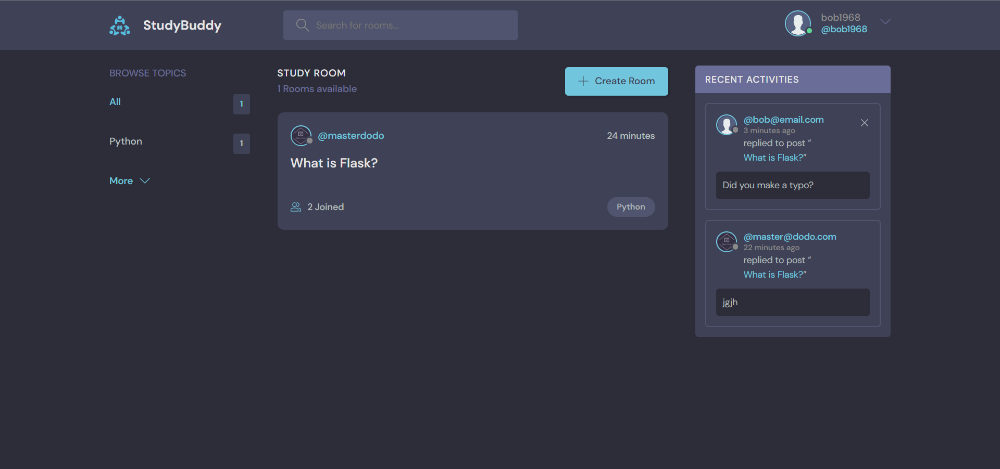

# Django StudyBuddy Application

Example of a Django application using the Django templates as the frontend.
Django REST API is used as an example under `api/` path.

Source: https://www.youtube.com/watch?v=PtQiiknWUcI

